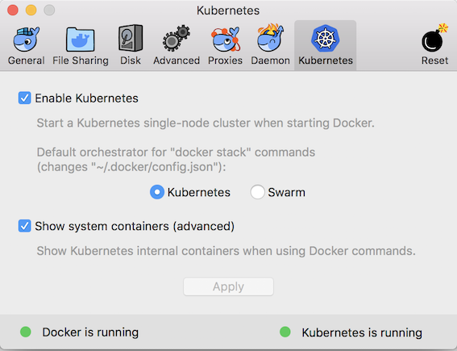
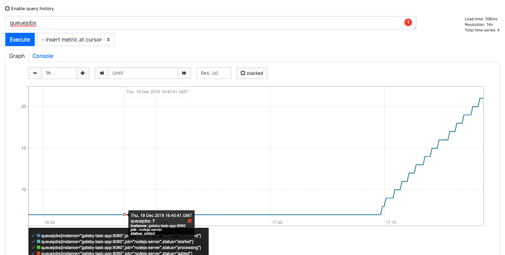
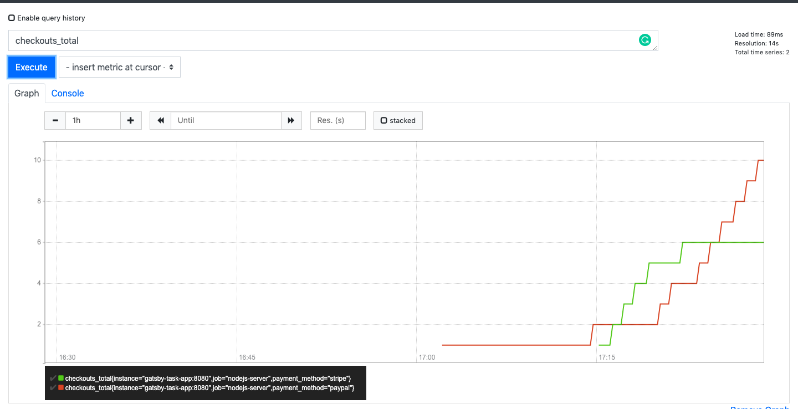

# Gatsby Interview Task

## Part 1 - Build A Simple NodeJS Application

A very simple Express application.
You can access `/foo` route to retrieve the response.
It logs the metrics information to `stdout`.

### Local Development
```
nodemon app.js
```

### Prepare Docker Image
```
# prepare docker image
docker build . -t pntripathi9417/nodejs-app:latest 

# push the docker image to central repository
docker push pntripathi9417/nodejs-app:latest

# run the docker application
docker run -p 8080:8080 -d pntripathi9417/nodejs-app:latest
```

## Part 2 - Deploy the application in kubernetes cluster

### Initialize Local Kubernetes Cluster MacOS
1. [Install Docker for Mac](https://docs.docker.com/docker-for-mac/install/) if
you have not already.
2. [Enable Kubernetes](https://docs.docker.com/docker-for-mac/#kubernetes)



3. Install terraform.

```
brew install terraform
```

### Deploy NodeJS Application
```
# navigate to kubernetes app directory
cd k8s/app

# initialize terraform
terraform init

# run terraform plan to verify everything is correct
terraform plan

# apply terraform changes
terraform apply
```

## Part 3 - Setup Grafana/Prometheus Monitoring for API metrics

For setting up prometheus/grafana follow [this blog](https://www.digitalocean.com/community/tutorials/how-to-set-up-a-kubernetes-monitoring-stack-with-prometheus-grafana-and-alertmanager-on-digitalocean)

#### Deploy Prometheus/Grafana setup
```
# navigate into k8s folder
cd k8s

# define required environment variables
export APP_INSTANCE_NAME=monitoring
export NAMESPACE=default
export GRAFANA_GENERATED_PASSWORD="$(echo -n 'testGrafanaUser2020' | base64)"

# Generate final manifest from monitoring folder. 
# It replaces the environment variables with corresponding values
awk 'FNR==1 {print "---"}{print}' monitoring/* \
 | envsubst '$APP_INSTANCE_NAME $NAMESPACE $GRAFANA_GENERATED_PASSWORD' \
 > "${APP_INSTANCE_NAME}_manifest.yaml"
```

## Part 4 - Add A Queue Functionality In The NodeJS App

It is done using `bee-queue`. `/jobqueue` route creates a job in the queue.
`/metrics` exposes all the metrics in to prometheus

## Part 5 - Setup Monitoring For Queues

```
kubectl --kubeconfig="kube-conf.yaml" port-forward monitoring-prometheus-0 9090
```





